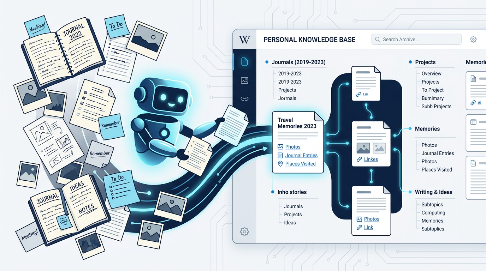

# Personal Wiki



A personal knowledge base that compiles your notes, journals, and messages into a structured, interlinked wiki — maintained entirely by an LLM agent. Inspired by [Farzaa](https://gist.github.com/farzaa/c35ac0cfbeb957788650e36aabea836d) and [Karpathy](https://gist.github.com/karpathy/442a6bf555914893e9891c11519de94f).

## How it works

```
data/          ← drop your source files here
    ↓
ingest         ← agent converts them to raw entries
    ↓
raw/entries/   ← one .md file per diary entry / note / message
    ↓
absorb         ← agent reads entries and compiles wiki articles
    ↓
wiki/          ← your personal Wikipedia (agent owns this)
    ↓
wiki-ui/       ← Next.js app that renders it in a browser
```

The agent writes and maintains all wiki articles. You source data, ask questions, and explore.

---

## Compatible tools

Open this project in whichever AI tool you use — the right config file is already there:


| Tool                    | Config file                                  | How to invoke operations      |
| ----------------------- | -------------------------------------------- | ----------------------------- |
| **Cursor** (agent mode) | `.cursor/rules/wiki.mdc`                     | Chat: "absorb all my entries" |
| **Gemini CLI**          | `GEMINI.md`                                  | Chat: "ingest my data"        |
| **OpenAI Codex**        | `AGENTS.md`                                  | Chat: "absorb last 30 days"   |
| **Claude Code**         | `CLAUDE.md` + `.claude/skills/wiki/SKILL.md` | Chat: "absorb all"            |
| **Any other agent**     | `AGENTS.md`                                  | Chat: describe what you want  |


No setup required — just open the project and start talking to your agent.

---

## Directory structure

```
personal-wiki/
├── AGENTS.md                     # Instructions for Codex + any agent
├── CLAUDE.md                     # Instructions for Claude Code
├── GEMINI.md                     # Instructions for Gemini CLI
├── .claude/
│   └── skills/wiki/SKILL.md      # Full canonical skill definition
├── .cursor/
│   └── rules/wiki.mdc            # Cursor agent rules
├── data/                         # Drop your source data here
├── raw/
│   └── entries/                  # Auto-generated by the ingest operation
├── wiki/                         # Agent-compiled knowledge base
│   ├── _index.md                 # Master article index
│   ├── _backlinks.json           # Reverse link index
│   ├── _absorb_log.json          # Tracks which entries are absorbed
│   └── (categories emerge here)
└── wiki-ui/                      # Wikipedia-clone UI (Next.js)
```

---

## Step 1: Drop your data

Put any of the following into `data/`:


| Format                    | How to export                                 |
| ------------------------- | --------------------------------------------- |
| **Day One**               | File → Export → JSON                          |
| **Apple Notes**           | Export folder as HTML or text                 |
| **Obsidian**              | Copy your vault folder                        |
| **Notion**                | Export as Markdown & CSV                      |
| **iMessage**              | Use an app like iExporter → CSV               |
| **Plain text / markdown** | Drop files directly                           |
| **Images**                | Put them alongside notes or in `data/assets/` |


---

## Step 2: Open your agent and talk to it

Open the project in your AI tool and use natural language. All agents understand the same operations:

**Ingest your data**

> "Ingest my data" / "Process the files in data/"

Converts everything in `data/` into individual markdown entries in `raw/entries/`. The agent writes an `ingest.py` script to do this. Safe to re-run.

**Compile the wiki**

> "Absorb all entries" / "Build the wiki" / "Compile everything"
> "Absorb entries from last 30 days" / "Absorb 2025"

Reads every entry and builds wiki articles. This is the core step. The agent synthesizes, connects, and writes — not just files, but *understanding*.

**Ask questions**

> "What are the recurring themes in my work?"
> "Tell me about my relationship with [person]"
> "What's my philosophy on product design?"
> "What inspired me most in 2025?"
> "What was happening in my life around March 2024?"

**Maintain and expand**

> "Clean up the wiki" — audit articles, fix structure, repair broken links
> "Find missing articles" — identify entities mentioned but not covered
> "Rebuild the index" — rebuild `_index.md` and `_backlinks.json`
> "Give me wiki stats" — article count, coverage, orphan articles

---

## Step 3: View in the browser

```bash
cd wiki-ui
npm run dev
```

Open [http://localhost:3000](http://localhost:3000). You get:

- **Main page** — categories and recently updated articles
- **Article pages** — Wikipedia-style layout with table of contents, backlinks, related articles
- **Category pages** — all articles by type (people, projects, philosophies, etc.)
- **All articles** — A–Z index
- **Search** — full-text search across all articles
- **Stats** — most linked, longest, orphan articles

The UI reads directly from `wiki/` — refresh the page to see new articles as the agent writes them.

---

## Tips

**Use Obsidian alongside your agent.** Open this repo in Obsidian to browse the wiki with graph view, rendered markdown, and the Dataview plugin for dynamic queries.

**Useful Obsidian plugins:**

- **Obsidian Web Clipper** — clip web articles to markdown directly into `data/`
- **Marp** — render wiki articles as slide decks
- **Dataview** — query frontmatter across all articles

**File outputs back into the wiki.** When you get a great answer from a query, ask the agent to save it as a new article. Your explorations compound.

**Run cleanup periodically.** "Clean up the wiki" uses parallel subagents to audit every article and fix structure, broken links, and stubs.

**Images work.** The agent can reference images from `data/assets/` in wiki articles. Download images locally with the Obsidian hotkey (Settings → Hotkeys → "Download attachments for current file").

---

## Article format

Every article in `wiki/` follows this format:

```markdown
---
title: Article Title
type: person | project | philosophy | pattern | era | decision | ...
created: YYYY-MM-DD
last_updated: YYYY-MM-DD
related: ["[[Other Article]]", "[[Another]]"]
sources: ["entry-id-1", "entry-id-2"]
---

# Article Title

Content organized by theme, not chronology.

## Section

[[Wikilinks]] to other articles.
```

The agent uses `[[wikilinks]]` to link articles. The UI resolves them to real links.

---

## Architecture

Based on the pattern from Karpathy and Farzaa:


| Layer                                  | What it is                                       |
| -------------------------------------- | ------------------------------------------------ |
| **Raw sources** (`data/`)              | Immutable. Agent reads, never modifies.          |
| **Entries** (`raw/entries/`)           | One file per logical entry. Generated by ingest. |
| **Wiki** (`wiki/`)                     | Agent-compiled knowledge base. Agent owns this.  |
| **Index** (`wiki/_index.md`)           | Catalog of all articles. Auto-maintained.        |
| **Backlinks** (`wiki/_backlinks.json`) | Reverse link map. Auto-rebuilt.                  |
| **UI** (`wiki-ui/`)                    | Read-only browser for the wiki.                  |


The key insight: the wiki is a **persistent, compounding artifact**. Cross-references already exist. Contradictions are flagged. Synthesis reflects everything you've read. It gets richer with every source and every question.